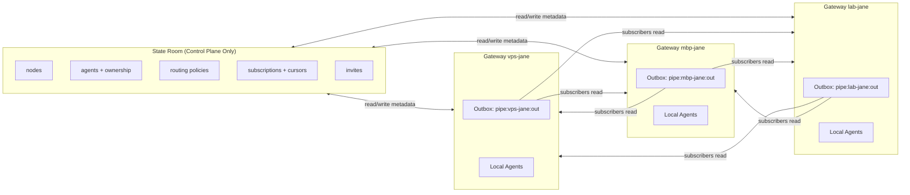
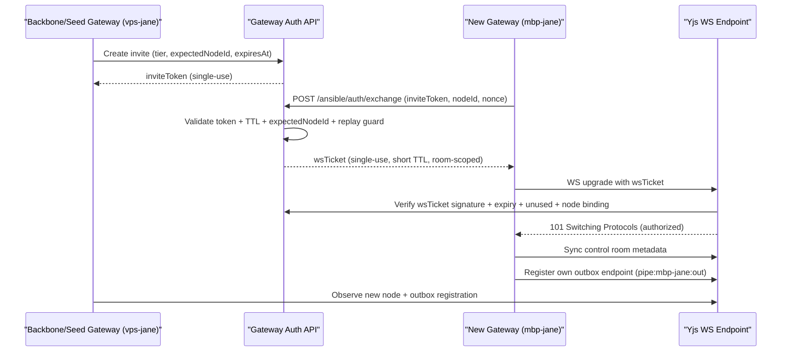
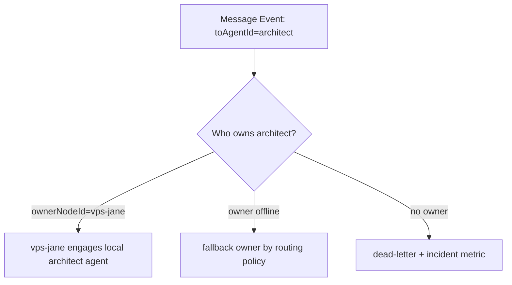
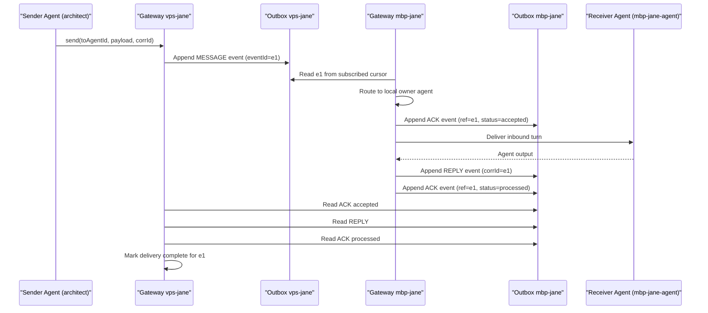
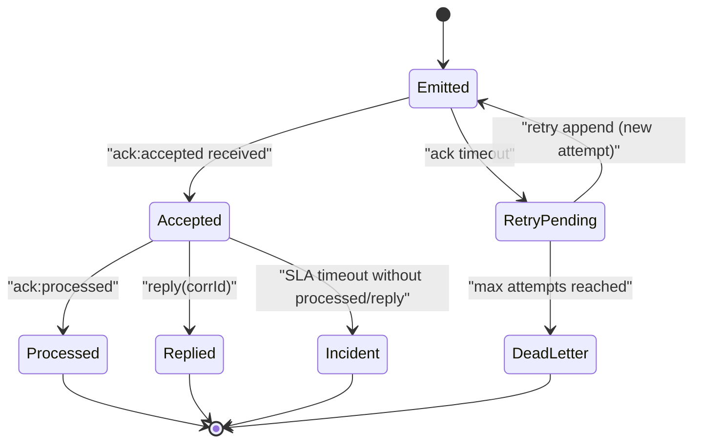

# Distributed Pipes v2 (State Room + Write-Only Outboxes)

Status: Draft  
Last updated: 2026-02-25

## Core Rules

1. Shared state room is metadata only.
2. Message/task payloads never live in shared state.
3. Each gateway can append only to its own outbox.
4. Gateways never append to another gateway's stream.
5. ACKs/replies are also events, emitted by the emitter's own outbox.

## 1) Topology

## 2) Joining and Discovery (Hardened Handshake)

Hard requirement:

- Invite token must be validated before any Yjs room connection is allowed.
- No anonymous read access to state room.

### Handshake API Contract

`POST /ansible/auth/exchange`

Request:

- `inviteToken`
- `nodeId`
- `nodeProof` (optional now, required in hardened mode; see below)
- `nonce`
- `requestedRooms` (default: control room only)

Response:

- `wsTicket` (JWT/PASETO-like signed token)
- `expiresAt` (30-60s)
- `rooms`
- `sessionId`

`wsTicket` claims:

- `iss`: gateway id
- `sub`: joining `nodeId`
- `aud`: `ansible-yjs`
- `rooms`: allowed room ids
- `inviteId`
- `jti` (unique ticket id)
- `iat` / `exp`

Validation order (must be strict):

1. verify invite token exists and unused
2. verify invite not expired
3. verify `expectedNodeId` matches request when set
4. verify replay guard (`inviteToken`, `nonce`, `jti`)
5. mint one-time `wsTicket`
6. consume invite token only on first successful WS auth

### Failure Codes

- `401 invalid_token`
- `401 expired_token`
- `403 node_mismatch`
- `409 token_already_used`
- `409 replay_detected`
- `401 invalid_ticket`
- `401 expired_ticket`
- `409 ticket_already_used`

### Node Proof (Recommended Hard Mode)

To avoid "whoever got the token first wins":

- Joining node signs challenge nonce with node key.
- Server verifies against pre-registered node public key or tailnet identity attestation.
- If proof missing/invalid, deny exchange.

This can be phased in:

1. v2a: token + expectedNodeId + short TTL + single-use ticket.
2. v2b: mandatory node proof for production profiles.

## 3) Routing Model (Agent-Level)

Routing is agent-first, not gateway-first.

- `agents.<agentId>.ownerNodeId` identifies where the target agent currently lives.
- `routing.<agentId>` can define fallback owners and capability constraints.
- Any gateway may read a sender outbox, but only the owner gateway engages the agent.

## 4) Full Message Lifecycle (ACK + Reply)

Assume sender agent `architect` on `vps-jane` sends to `mbp-jane-agent` on `mbp-jane`.

## 5) Event Types

Minimum event kinds:

- `message`
- `ack`
- `reply`
- `task_create`
- `task_accept` (includes expected completion time)
- `task_update`
- `task_complete`
- `task_failed`
- `signal` (presence/maintenance/control hints)
- `dead_letter`

Envelope fields:

- `eventId` (unique)
- `sourceNodeId`
- `sourceAgentId`
- `toAgentId` (optional for broadcast/system)
- `corrId` (required for replies/acks)
- `kind`
- `createdAt`
- `payload` or `payloadRef`
- `trace` (attempt, routeDecision, policyVersion)

## 6) ACK Semantics

Use two ACK levels:

1. `accepted`
- Receiver gateway has durably recorded the inbound event and committed to process.

2. `processed`
- Receiver agent turn completed (or terminal failure recorded).

Rules:

- Sender stops fast-retry once `accepted` is seen.
- Sender closes loop when `processed` or `reply` is seen.
- If `accepted` exists but no `processed/reply` within SLA, sender raises incident and may request status.

Task-specific requirement:

- `ack:accepted` for `task_create` SHOULD include `etaAt` (or `etaSeconds`) and optional execution plan summary.

## 7) Retry, Idempotency, and Cursors

Retry:

- Sender retries publish intent only if no `accepted` ACK.
- Backoff: exponential + jitter.
- Max attempts -> emit `dead_letter` from sender outbox.

Idempotency:

- Receiver dedupes by `eventId`.
- Duplicate reads do not produce duplicate agent turns.

Cursors:

- Each gateway keeps per-source cursor (`lastSeenSeqBySourceNode`).
- Cursor metadata goes in state room; payload stays in outboxes.

## 8) Notification and Engagement Pipeline

Three distinct phases:

1. Routed:
- gateway resolves owner from state room.

2. Notified:
- owner gateway emits `ack:accepted` (proof of receipt).

3. Engaged:
- owner gateway dispatches into local runtime/agent turn.
- completion becomes `reply` and/or `ack:processed`.

This separation prevents silent black holes where delivery and engagement are conflated.

## 9) Capability Publish and Skill Pair Lifecycle

Capability publication is the control-plane event that activates routing.

Rules:

1. A capability publish MUST declare:
- `capabilityId`
- `ownerAgentId`
- delegation skill reference + version
- executor skill reference + version
- contract schema + default ETA

2. The owner agent MUST host the executor skill.
3. Publish updates `capabilities.catalog` and `capabilities.index`.
4. Unpublish/removal MUST remove routing eligibility.

### Distribution Fanout Task

On successful publish, system creates a distribution task for all non-owner agents:

- `taskType=skill_distribution`
- targets: all active agents except executor owner
- payload: delegation skill reference + expected install/version
- response required: install status + timestamp

Purpose:
- ensures every requester-side agent can delegate using the new capability contract.

### Timing and Workflow Contracts

Delegation skill contract (requester side):
- when to create task
- required capability ids
- expected response format
- escalation policy

Executor skill contract (owner side):
- accept/ETA response format
- progress cadence
- completion/failure payload schema

### Misfire and Auto-Review

Create skill-review incident when any occurs:

1. ETA/SLA breach
2. terminal execution error
3. output contract mismatch
4. repeated routing miss for published capability

Review item should include:
- capabilityId
- delegation skill version
- executor skill version
- failure class
- sample corrIds/events

## 10) Failure Modes

## 11) Do We Still Need Backbone/Edge?

Protocol:

- No hard backbone/edge requirement if any node can host state and outboxes.

Operations:

- You still need reliable rendezvous seeds for discovery and recovery.
- Recommended: multiple seed nodes, not a single special backbone.

## 12) External Agent Interface Boundary

External agents are not transport peers.

- They do not read/write Yjs rooms directly.
- They interact through gateway agent endpoints with scoped session tokens.
- Gateway mediates routing and emits pipe events on their behalf.

Reference:
- `docs/external-agent-auth-v1.md`

## 13) Minimal Implementation Plan

1. Add outbox abstraction per gateway.
2. Add auth exchange endpoint and single-use wsTicket validation in WS upgrade path.
3. Add event envelope + ACK/reply kinds.
4. Add subscription cursors in state room.
5. Move dispatcher to outbox-consumer model.
6. Keep old shared message map as read-only fallback during migration.
