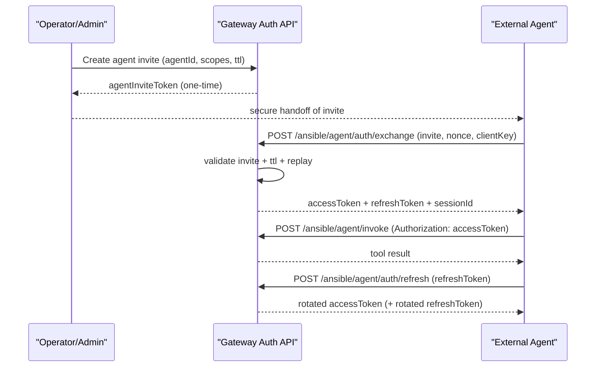

# External Agent Auth v1 (Codex / Claude Code)

Status: Draft Spec  
Last updated: 2026-02-25

## Decision

External agents should interface with Ansible as **external principals**, not as full mesh gateways.

- They do not join Yjs rooms directly.
- They call agent-scoped HTTP endpoints on a trusted gateway.
- They use short-lived session credentials, not long-lived static bearer tokens.

## Terminology

- `Gateway token`: long-lived admin token used by operators/internal gateway tooling (`/tools/invoke`).
- `External agent`: non-gateway runtime (for example Codex or Claude Code).
- `Agent invite token`: one-time short-lived onboarding token for an external agent identity.
- `Access token`: short-lived token used for normal API calls (5-15 min).
- `Refresh token`: longer-lived revocable token used only to mint new access tokens.
- `Context token`: ultra-short-lived token scoped to a specific thread/session/action set.
- `PoP`: proof-of-possession; token is bound to a client-held key and a request signature, not bearer-only.
- `Scope`: fine-grained permission string (for example `ansible.message.send`).
- `Session`: auth lifecycle for one connected external agent context.
- `CorrId`: correlation id used to tie request/reply/ack events together.

## Threat Model Goals

1. Never give external agents gateway-admin credentials.
2. Limit blast radius if a token leaks.
3. Prevent replay and token forwarding across clients.
4. Make revocation and rotation operationally cheap.

## Protocol Overview

## Endpoint Spec

### 1) Create Invite (admin path)

`POST /ansible/agent/invites`

Auth:
- requires gateway/operator admin auth (existing mechanism)

Request:
- `agentId`
- `scopes` (array)
- `ttlSeconds` (recommended max 900)
- `constraints` (optional): allowed origins, model/provider hints, max sessions

Response:
- `inviteToken` (one-time)
- `inviteId`
- `expiresAt`

### 2) Exchange Invite (external path)

`POST /ansible/agent/auth/exchange`

Auth:
- no gateway token required
- authenticated by `inviteToken` + anti-replay material

Request:
- `inviteToken`
- `agentId`
- `nonce`
- `clientPubKey` (required in hardened mode)
- `clientProof` (signature over challenge/request hash; required in hardened mode)

Response:
- `accessToken`
- `accessExpiresAt`
- `refreshToken`
- `refreshExpiresAt`
- `sessionId`
- `grantedScopes`

Validation:
1. invite exists, unused, not expired
2. `agentId` matches invite
3. nonce not replayed
4. client proof valid (hardened mode)
5. consume invite

### 3) Refresh Session

`POST /ansible/agent/auth/refresh`

Auth:
- refresh token only

Request:
- `refreshToken`
- `nonce`
- optional PoP proof

Response:
- new `accessToken`
- optional rotated `refreshToken` (recommended: rotate every time)

Validation:
1. refresh token valid + not revoked + not expired
2. session active
3. replay guard on nonce/jti
4. PoP binding valid (if enabled)

### 4) Invoke Ansible as External Agent

`POST /ansible/agent/invoke`

Auth:
- access token (and PoP header/signature in hardened mode)

Request:
- `operation` (for example `ansible_send_message`)
- `args`
- `contextId` (optional)

Response:
- operation result envelope

Authorization:
- allow only operations covered by `grantedScopes`
- enforce policy constraints (rate, destinations, task classes)

### 5) Mint Context Token (optional but recommended)

`POST /ansible/agent/context-token`

Auth:
- access token

Request:
- `contextId` (thread/task/session id)
- `scopes` (must be subset of access token scopes)
- `ttlSeconds` (recommended <= 300)

Response:
- `contextToken`
- `expiresAt`

Use:
- pass context token for highly sensitive operations
- limits token usefulness outside the target context

## Token Profiles

- Access token TTL: 5-15 minutes
- Refresh token TTL: 1-7 days
- Context token TTL: 1-5 minutes
- Invite token TTL: 5-15 minutes, one-time

Token claims (minimum):
- `iss`, `sub` (agentId), `aud`
- `scope`
- `sessionId`
- `jti`
- `iat`, `exp`
- optional `cnf` (PoP key thumbprint)

## Recommended Scopes

- `ansible.message.read`
- `ansible.message.send`
- `ansible.task.read`
- `ansible.task.claim`
- `ansible.task.update`
- `ansible.task.complete`
- `ansible.status.read`
- `ansible.admin.*` (avoid for external agents by default)

## Failure Codes

- `401 invalid_invite`
- `401 expired_invite`
- `409 invite_used`
- `403 scope_denied`
- `401 invalid_access_token`
- `401 expired_access_token`
- `401 invalid_refresh_token`
- `409 replay_detected`
- `429 rate_limited`

## Security Controls Checklist

1. Store token hashes, not raw token values, at rest.
2. Rotate signing keys with `kid` support.
3. Enforce jti/nonce replay cache for invite, refresh, and invoke in PoP mode.
4. Revoke by `sessionId`, `agentId`, and token family.
5. Emit auth audit records with actor, scope, operation, corrId.
6. Default deny for unknown scopes/operations.

## Integration With State/Delivery Model

- External agents interact through gateway API, not Yjs.
- Gateway emits/consumes pipe events on the agent’s behalf.
- Routing still uses shared control plane ownership + policy.

## Open Questions

1. Require PoP by default now, or phase in per environment?
2. Should refresh tokens be one-time-use only (strict rotation) or grace-window dual valid?
3. Do we need provider-specific constraints (Codex vs Claude Code) in scope policy?

