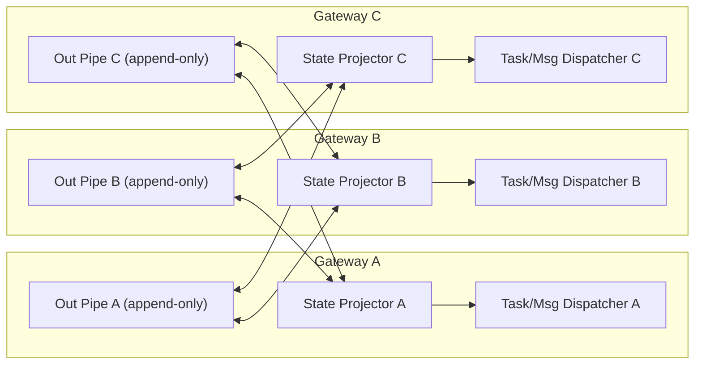
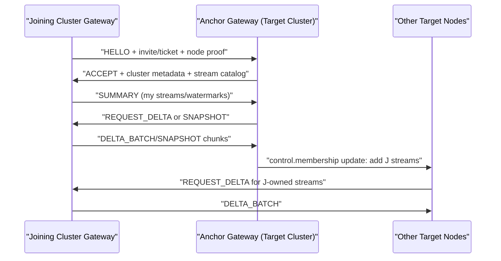

# MVP-4 Network Replication Without Yjs (Proposal & Plan)

Status: draft  
Last updated: 2026-03-03

## Executive Summary

We should remove Yjs as the state replication substrate and replace it with a network-native replication layer built around:

1. Signed append-only event logs.
2. Topic/stream replication over direct gateway links.
3. Anti-entropy synchronization (delta + snapshot) at the protocol level.
4. Deterministic materialized views for state-room reads.

Recommendation:

1. Keep the control-plane data model (stateroom concepts) but move replication from CRDT/Yjs to an explicit protocol.
2. Use per-topic event streams with idempotent event IDs and cursor-based ACKs.
3. Adopt eventual consistency with bounded staleness, not global strong consistency.
4. Implement the runtime core as Rust-first (sidecar/core service), with TypeScript plugin surface retained during migration.

Why now:

1. Better operational control (backpressure, replay bounds, error taxonomy).
2. Explicit semantics for ACK/retry/dead-letter instead of CRDT side effects.
3. Lower coupling to doc-level CRDT behavior that is hard to reason about in incidents.

## Problem Statement

Current Yjs-based behavior gives good merge properties but hides too many transport/runtime decisions:

1. Replication and state semantics are intertwined.
2. ACK/read/delivery semantics are layered on top of a doc store rather than native message primitives.
3. Incident controls (drain, flood prevention, replay budget) are after-the-fact policy, not protocol-native.
4. Multi-cluster merges and pipe ownership transitions are awkward in a monolithic shared doc model.

Additional observed defects to follow up tomorrow:

1. Send notifications not consistently visible end-to-end in user workflows.
2. Some assigned tasks are not triggering expected executor behavior.

These defects reinforce the need for explicit transport contracts and deterministic runtime transitions.

## Goals

1. Remove Yjs dependency from runtime replication path.
2. Preserve decentralized topology (no mandatory backbone singleton).
3. Keep "state-room for state only" and move message traffic to explicit pipe streams.
4. Make delivery lifecycle first-class: accepted, delivered, processed, replied, failed.
5. Support safe federation/merge of two independent ansible clusters.
6. Provide strong observability and operator controls.
7. Align implementation with planned Rust core migration.

## Non-Goals

1. Perfect global ordering across all nodes.
2. Immediate rewrite of every CLI/tool interface.
3. Cross-region consensus for every write (too expensive for this use case).

## Target Semantics

### Consistency

1. Per-topic total order (by stream offset on the writer/owner).
2. Cross-topic causal hints via Lamport/HLC timestamps + correlation IDs.
3. Eventual consistency for materialized state-room view.

### Delivery Guarantees

1. At-least-once network delivery.
2. Idempotent apply everywhere (exactly-once effect at handler boundary via idempotency keys).
3. Explicit dead-letter transitions after bounded retries.

### Ownership Model

1. Each gateway owns exactly one outbound pipe stream for messages/tasks it emits.
2. Peers subscribe/read other gateways' outbound streams.
3. No peer writes into another gateway's outbound stream.

## High-Level Architecture



Key rule:

1. Streams carry immutable events.
2. State-room is a local derived view, never the transport itself.

## Protocol Model (ANSP v1)

ANSP: Ansible Network Sync Protocol.

### Transport

1. Preferred: persistent TCP/TLS (or Noise) sessions per peer.
2. Framing: length-prefixed protobuf or msgpack envelopes.
3. Compression: zstd optional at frame level.

### Core Envelope

```text
Envelope {
  version: 1
  cluster_id: string
  from_node: string
  stream_id: string
  event_id: string           // ULID/UUIDv7
  seq: uint64                // monotonic per stream owner
  hlc: uint64                // hybrid logical clock
  event_type: string
  payload_hash: bytes32
  signature: bytes64         // ed25519 over canonical bytes
  payload: bytes
}
```

### Control Messages

1. `HELLO`: peer identity, protocol version, cluster id, auth proof.
2. `SUMMARY`: per-stream high-water marks.
3. `REQUEST_DELTA`: ask for `[from_seq+1..to_seq]` on stream.
4. `DELTA_BATCH`: batch of envelopes.
5. `SNAPSHOT_META` and `SNAPSHOT_CHUNK`: checkpoint transfer.
6. `ACK_CURSOR`: consumer processed up to seq.
7. `NACK`: protocol-level rejection with machine code.

### Security and Admission

1. Keep invite/token/ticket handshake concept.
2. Promote to protocol gate before replication start.
3. Require node keypair and signed challenge.
4. Bind node identity to stream ownership.

## State Model Without Yjs

### Data Planes

1. `control.membership`: nodes, endpoints, admin nominations, capabilities.
2. `control.routing`: capability->agents, delegation metadata.
3. `pipe.<gatewayId>.out`: outbound tasks/messages/events owned by gateway.
4. `ops.audit`: lifecycle/audit/error events.

### Local Storage

1. Write-ahead log per stream (append-only segments).
2. Materialized views in embedded DB (SQLite/RocksDB).
3. Cursor table per peer/per stream.

### Materialization

Projectors build queryable views:

1. `tasks_view`
2. `messages_view`
3. `agents_view`
4. `coordination_view`

Projectors are deterministic and replayable from logs.

## ACK, Replies, and Task Lifecycle

### Lifecycle States

1. `created`
2. `accepted` (with ETA)
3. `in_progress`
4. `completed` | `failed_terminal` | `failed_retryable`
5. `closed`

### Event Types

1. `task.created`
2. `task.accepted`
3. `task.progress`
4. `task.completed`
5. `task.failed`
6. `message.sent`
7. `message.read`
8. `message.replied`

### ACK Semantics for Fan-Out

1. Requester gets one ACK stream per target agent.
2. Aggregator view computes summary (`N targets, M accepted, K completed`).
3. Caller policy can be:
   1. `first_success`
   2. `quorum`
   3. `all_targets`

No hidden implicit ACK in doc state; everything is explicit events.

## Cluster Merge (Two Independent Ansible Systems)

### Merge Overview



### Safety Rules

1. Only one anchor performs admission for a join session.
2. Stream ownership never changes during merge.
3. Conflicting `cluster_id` requires explicit federation mode and operator approval.
4. Membership updates are events, not side-channel config edits.

## Backpressure and Storm Prevention

Protocol-level controls:

1. Per-stream rate limits.
2. Per-peer max in-flight batches.
3. Retry budgets by event class.
4. Circuit breaker when error ratio exceeds threshold.
5. Admin drain command at protocol layer (`stream.pause`, `stream.drop_policy`).

Policy-level controls:

1. Distribution mode (`strict`/`all`) remains, but enforced before enqueue.
2. Skill-distribution tasks use deterministic executor path; no LLM fanout for pure transport tasks.

## Failure Model and Recovery

### Network Partition

1. Writers continue appending locally.
2. Peers reconcile by cursors after reconnect.
3. If gap exceeds retention window: snapshot required.

### Crash Recovery

1. Replay WAL from last committed segment.
2. Resume cursors from durable cursor table.
3. Idempotent projector rebuild if view checksum mismatch.

### Corruption Handling

1. Segment checksum validation on read.
2. Automatic quarantine of corrupted segment.
3. Peer re-fetch for missing range.

## Migration Plan (Yjs -> ANSP)

### Phase 0: Contract Freeze

1. Freeze event schema and failure taxonomy.
2. Add conformance fixtures.

Exit gate:

1. Fixtures approved and versioned.

### Phase 1: Dual-Write (Shadow)

1. Keep Yjs as source of truth.
2. Mirror all writes into ANSP log.
3. Compare projected views vs Yjs-derived views.

Exit gate:

1. Zero critical divergence in 72h soak.

### Phase 2: Dual-Read with Read Preference

1. Runtime reads ANSP views first.
2. Fallback to Yjs if ANSP unavailable.
3. Alert on fallback usage.

Exit gate:

1. <0.1% fallback rate over soak window.

### Phase 3: ANSP Primary, Yjs Safety Mirror

1. Writes originate in ANSP.
2. Optional Yjs mirror for rollback only.

Exit gate:

1. Incident-free soak and rollback drill pass.

### Phase 4: Remove Yjs Runtime Dependency

1. Delete Yjs transport/runtime path.
2. Keep one offline import tool for historical migration.

## API/Tool Compatibility Plan

1. Preserve existing CLI verbs (`ansible send`, `tasks`, `capability`, etc.).
2. Internals switch from Yjs map mutation to event emission.
3. Keep current error codes where possible; add machine-stable ANSP codes.

## Observability and SLOs

### Core Metrics

1. `replication_lag_seconds{stream,peer}`
2. `event_apply_latency_ms{type}`
3. `delivery_attempts_total{type,result}`
4. `dead_letter_total{reason}`
5. `snapshot_transfer_bytes_total`

### SLO Targets (Initial)

1. P95 peer replication lag < 5s on healthy links.
2. P95 task accept ACK < 10s for online agents.
3. 99.9% no-data-loss across single-node restart.

## Security Posture

1. Node keypair identity with rotation support.
2. Signed envelopes; reject unsigned/invalid signatures.
3. Invite/ticket exchange remains short-lived and single-use.
4. Replay protection via `(stream_id, seq, event_id)` dedupe.
5. Optional mTLS for transport encryption/auth hardening.

## Rust Alignment (Planned)

This proposal is intentionally Rust-friendly:

1. ANSP runtime core should be implemented in Rust first.
2. TS plugin remains orchestration/CLI boundary during transition.
3. Suggested crate split:
   1. `ansp-protocol`
   2. `ansp-logstore`
   3. `ansp-projector`
   4. `ansp-replicator`
   5. `ansp-gateway-service`

This matches the Rust proposal direction while keeping delivery momentum.

## Risks and Mitigations

1. Increased system complexity.
   1. Mitigation: phased migration + strict conformance tests + canary rollout.
2. Dual-write drift during transition.
   1. Mitigation: deterministic compare tooling + stop-the-line on critical divergence.
3. Operational burden of snapshots/retention.
   1. Mitigation: automated compaction, retention policy, and snapshot health checks.

## Decision Log (For Tomorrow)

Needs explicit decision:

1. Transport framing: protobuf vs msgpack.
2. Local store: SQLite WAL vs RocksDB.
3. Security baseline: mTLS required or optional.
4. Fan-out completion policy defaults (`first_success`/`quorum`/`all_targets`).
5. Snapshot cadence and retention window.

## Proposed Work Items

1. `WI-MVP4-001`: ANSP schema and envelope signing spec.
2. `WI-MVP4-002`: Replicator + cursor ACK implementation (shadow mode).
3. `WI-MVP4-003`: Projector parity harness against Yjs baseline.
4. `WI-MVP4-004`: Cluster merge protocol implementation.
5. `WI-MVP4-005`: Operator controls (pause/drain/replay).

## Confidence

Current confidence: Medium.

Reason:

1. Architecture is strong and aligns with your decentralized pipe ownership model.
2. Main uncertainty is migration execution risk, not target design quality.
3. Phased dual-write rollout keeps risk manageable.

## Recommendation

Proceed with MVP-4 design validation and Phase 0 contract freeze tomorrow, in parallel with the defect triage (notification visibility + task executor triggering), then begin ANSP shadow implementation in Rust-aligned core components.

## Related Deep Dive

1. UDP transport evaluation on Tailscale: [`docs/udp-over-tailscale-replication-proposal-v1.md`](../udp-over-tailscale-replication-proposal-v1.md)
