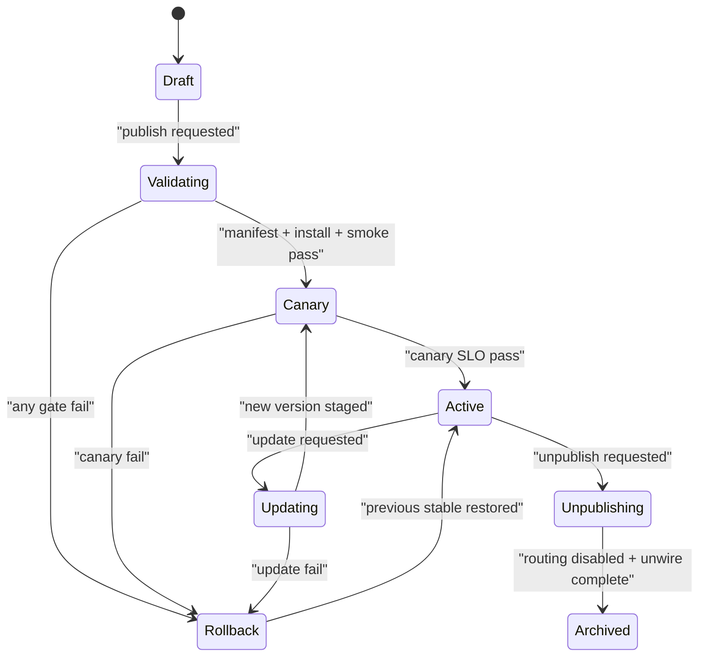

# Skill Pair Lifecycle DoD v1

Status: Draft  
Last updated: 2026-02-26

## Purpose

Define objective release gates for capability skill pairs:

- delegation skill (requester side)
- executor skill (owner side)

This document is the implementation checklist for publish, update, and unpublish.

## Scope

Applies to:

1. Capability publish/update/unpublish.
2. Skill installation/wiring in agent workspaces.
3. Task runtime lifecycle guarantees (accept -> update -> complete/fail).

## Core Artifacts

## `SkillPairManifest`

Required fields:

1. `capabilityId`
2. `version`
3. `ownerAgentId`
4. `compatibilityMode` (`strict|backward|legacy-window`)
5. `delegationSkillRef` (`name`, `version`, optional `path`, optional `source`)
6. `executorSkillRef` (`name`, `version`, optional `path`, optional `source`)
7. `contract`:
   - `inputSchemaRef`
   - `outputSchemaRef`
   - `ackSchemaRef`
8. `sla`:
   - `acceptSlaSeconds`
   - `progressSlaSeconds`
   - `completeSlaSeconds`
9. `riskClass` (`low|medium|high`)
10. `provenance`:
   - `publishedByAgentId`
   - `manifestChecksum`
   - `manifestSignature`
11. `rollout`:
   - `mode` (`canary|full`)
   - `canaryTargets` (optional)

## Default recommendations

1. `compatibilityMode`: `strict`
2. `acceptSlaSeconds`: `120`
3. `progressSlaSeconds`: `900`
4. `completeSlaSeconds`: `3600`
5. `riskClass`: `medium`
6. `rollout.mode`: `canary`

## Definition Of Done Gates

## 1) Ownership Transfer

Recommendation:

- Use lease-based owner liveness.
- `leaseHeartbeatSeconds=30`, failover after `90` seconds missed.
- Maintain `primaryOwner` + `standbyOwners[]`.

DoD:

1. Owner offline triggers deterministic transfer.
2. `capabilities.index` updates to new eligible owner.
3. In-flight tasks are resumed or terminal-failed with explicit reason.

## 2) Version Negotiation

Recommendation:

- Enforce `requestedVersion` + `resolvedVersion` handshake on task accept.

DoD:

1. Executor always responds with resolved version.
2. Mismatch behavior follows `compatibilityMode`.
3. Unsupported version returns deterministic reject (`409 version_incompatible`).

## 3) Deterministic Rollback

Recommendation:

- Two-phase rollout state machine:
  - `draft -> validating -> canary -> active`
  - auto rollback to previous active on any failed gate.

DoD:

1. Partial install failure reverts all routing + workspace wiring.
2. Previous active manifest is restored without manual intervention.
3. Rollback event is emitted with reason and failing node list.

## 4) Idempotency and Dedupe

Recommendation:

- Use idempotency key: `taskId + action + actorId`.

DoD:

1. Duplicate accept/update/complete does not duplicate state transitions.
2. Duplicate notifications are collapsed by idempotency key.
3. Replayed events remain safe after restart.

## 5) Timeout and Escalation

Recommendation:

- Add timeout engine that evaluates SLA breaches per capability and task.

DoD:

1. Missed accept SLA emits escalation event.
2. Missed progress SLA marks task `stalled`.
3. Missed completion SLA marks `breached` and notifies requester + admin.

## 6) Human Approval Gates

Recommendation:

- Require explicit approval for `riskClass=high` before execution starts.

DoD:

1. High-risk task cannot move to `in_progress` without approval artifact.
2. Approval records who approved and when.
3. Rejected approvals produce terminal `failed_terminal`.

## 7) Secrets and Trust Boundaries

Recommendation:

- Secrets must be local-only (keychain/secret store), never in state room or manifest payload.

DoD:

1. Publish validator blocks secret-like literals in manifest and skill payloads.
2. Runtime redacts secret fields from logs/events.
3. Exchange endpoints and manifest fetch paths are audited.

## 8) Observability Contract

Recommendation:

- Expose task lifecycle timeline and capability SLO metrics.

DoD:

1. One query returns full task timeline:
   - `created`, `accepted`, `in_progress`, `completed/failed`
2. Capability dashboard includes:
   - success rate
   - p95 accept latency
   - p95 completion latency
   - failure taxonomy

## 9) Concurrency and Backpressure

Recommendation:

- Per executor capability limits:
  - `maxConcurrent`
  - `maxQueueDepth`
  - `retryBudget`

DoD:

1. Overload creates deterministic queueing or rejection (`429 overloaded`).
2. Retry storms are bounded by budget.
3. Queue metrics are visible in status tooling.

## 10) Governance and Provenance

Recommendation:

- Require signed manifest with checksum verification at publish/update.

DoD:

1. Unsigned/tampered manifest is rejected.
2. Audit trail records:
   - who published
   - who approved
   - what checksum was activated
3. Unpublish preserves archived manifest for forensic rollback.

## Workflow State Machine

## Implementation Priority

1. Ownership transfer.
2. Version negotiation.
3. Rollback state machine.
4. Idempotency keys.
5. SLA timeout engine.
6. High-risk approval gate.
7. Secret scanning + redaction.
8. Lifecycle query + SLO metrics.
9. Concurrency controls.
10. Signed manifest governance.

## Review Checklist

Use this section to approve/tweak defaults:

- [ ] Ownership lease and failover timers.
- [ ] Compatibility modes and default.
- [ ] Rollout + rollback gates.
- [ ] Idempotency key format.
- [ ] SLA defaults.
- [ ] High-risk approval policy.
- [ ] Secret handling policy.
- [ ] Observability minimums.
- [ ] Backpressure limits.
- [ ] Signature/provenance requirements.
