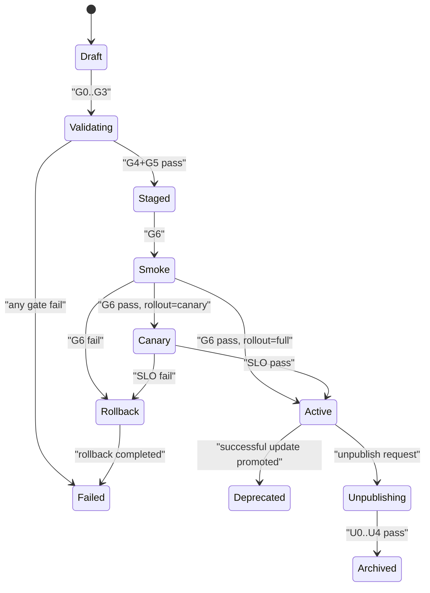

# Skill Pair Publish Gate Executor v1

Status: Draft  
Last updated: 2026-02-26

## Goal

Define the exact gate order that `ansible-main` must execute for:

1. publish
2. update
3. unpublish

This order is normative to keep lifecycle behavior deterministic.

## Roles

1. `ansible-meta`: creates/updates manifest + skill pair artifacts.
2. `ansible-main`: executes lifecycle gates and state transitions.
3. plugin runtime: enforces task/message contract semantics at execution time.

## Gate Pipeline: Publish

Input:

1. `SkillPairManifest`
2. delegation/executor skill assets
3. publish actor identity + auth

Execution order:

1. `G0_AUTHZ`
   - verify actor is authorized admin/publisher
   - fail: `403 not_authorized`
2. `G1_SCHEMA`
   - validate manifest against `schema://ansible/skill-pair-manifest/1.0.0`
   - fail: `400 invalid_manifest`
3. `G2_PROVENANCE`
   - verify checksum + signature
   - fail: `401 invalid_signature`
4. `G3_OWNER_LIVENESS`
   - confirm `ownerAgentId` exists and is currently routable
   - fail: `409 owner_unavailable`
5. `G4_INSTALL_STAGE`
   - stage executor skill on owner target(s)
   - stage delegation skill on requester target(s)
   - fail: `409 install_failed`
6. `G5_WIRE_STAGE`
   - wire staged skills into workspace indexes (not active routing yet)
   - fail: `409 wire_failed`
7. `G6_SMOKE_TEST`
   - run synthetic task using declared contract
   - enforce accept/update/complete cycle
   - fail: `409 smoke_failed`
8. `G7_ROLLOUT`
   - if `rollout.mode=canary`: activate for canary targets only
   - if `rollout.mode=full`: activate for all eligible targets
   - fail: `409 rollout_failed`
9. `G8_INDEX_ACTIVATE`
   - write `capabilities.catalog` and `capabilities.index` active records
   - emit `capability_published` lifecycle event
10. `G9_POSTCHECK`
   - verify readback consistency and emit audit summary
   - pass: status becomes `active`

## Gate Pipeline: Update

Treat update as publish of a new version with active predecessor:

1. run `G0`..`G9` with new version staged
2. upon success:
   - set new version `active`
   - set previous version `deprecated` (or `archived` by policy)
3. on failure:
   - keep previous version active

## Gate Pipeline: Unpublish

1. `U0_AUTHZ`
2. `U1_DISABLE_ROUTING`
   - remove eligible agents from index
3. `U2_UNWIRE`
   - detach delegation/executor bindings from workspace indices
4. `U3_ARCHIVE`
   - persist manifest revision as archived
5. `U4_EMIT`
   - emit `capability_unpublished` lifecycle event

## Rollback Behavior

Rollback triggers:

1. any publish/update gate failure from `G4` onward
2. canary SLO breach within soak window
3. postcheck mismatch

Rollback actions:

1. disable staged routing
2. unwind skill wiring
3. remove staged installs (or mark tombstoned if remove unsafe)
4. restore previous active index/catalog pointers
5. emit `capability_publish_rollback` event with reason + failing targets

## State Machine

## Runtime Enforcement Hooks (must exist)

1. claim -> must persist `ack=accepted` with ETA for contract-bound tasks
2. update in-progress -> requires prior accepted ack
3. complete -> contract-bound tasks require result payload
4. failed -> requires diagnostic note/result

## Required Audit Events

1. `capability_publish_requested`
2. `capability_publish_gate_failed`
3. `capability_published`
4. `capability_publish_rollback`
5. `capability_unpublished`

## Open Decisions

1. canary soak duration default (`5m` suggested)
2. uninstall policy (`hard-remove` vs `tombstone-disabled`)
3. update predecessor state (`deprecated` vs immediate `archived`)
